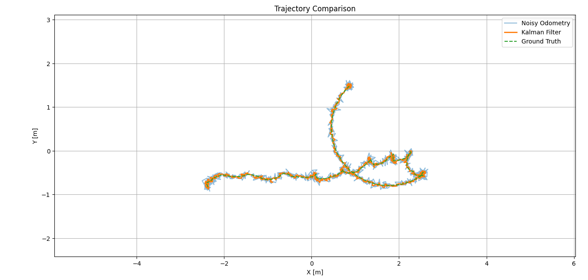

# 🚀 Kalman Filter–Based Odometry Estimation  
**ROS2 Humble · C++ · Robotics State Estimation**

> A practical demonstration of **Kalman Filter–based odometry fusion** for mobile robots, showing how probabilistic state estimation improves localization stability under noisy sensor data.

---

## 📌 Project Motivation

In real robotic systems, odometry measurements are **inherently noisy**, causing drift, instability, and unreliable navigation.

This project demonstrates:
- How **raw odometry degrades motion estimation**
- How a **Kalman Filter** improves trajectory smoothness and orientation stability
- How these differences are **visualized and logged** using ROS2 tools

This mirrors **industry-standard localization pipelines** used in mobile robots, AGVs, and autonomous systems.

---

## 🧠 System Overview

### Estimation Pipeline
```

Gazebo Robot Motion
↓
/odom (raw)
↓
┌───────────────┐
│  Noise Model  │
│ (/odom_noisy) │
└───────────────┘
↓
┌───────────────┐
│ Kalman Filter │
│   (/odom_kf)  │
└───────────────┘
↓
RViz2
(Trajectory Comparison)

````

---

## 📊 What Is Being Showcased?

| Component | Purpose |
|---------|--------|
| `/odom_noisy` | Simulated noisy odometry (zig-zag, unstable yaw) |
| `/odom_kf` | Filtered odometry (smooth, stable trajectory) |
| RViz2 | Real-time trajectory & orientation comparison |
| ROS2 bag | Offline reproducible data logging |
| Python | Quantitative trajectory visualization |

---

## 📷 **Trajectory Comparison**


> The Kalman Filter output exhibits smoother motion and more consistent yaw compared to raw noisy odometry.

---

## 🗂️ Data Logging & Offline Analysis

### Recorded Topics
```bash
/odom
/odom_noisy
/odom_kf
````

### Convert ROS2 Topics to CSV

```bash
ros2 topic echo /odom_kf --csv > odom_kf.csv
ros2 topic echo /odom_noisy --csv > odom_noisy.csv
ros2 topic echo /odom --csv > odom_gt.csv
```

---

## 📈 Offline Trajectory Visualization (Python)

```python
import pandas as pd
import matplotlib.pyplot as plt

kf = pd.read_csv("odom_kf.csv")
noisy = pd.read_csv("odom_noisy.csv")
gt = pd.read_csv("odom_gt.csv")

plt.figure()
plt.plot(noisy["pose.pose.position.x"], noisy["pose.pose.position.y"],
         label="Noisy Odometry", alpha=0.5)

plt.plot(kf["pose.pose.position.x"], kf["pose.pose.position.y"],
         label="Kalman Filter", linewidth=2)

plt.plot(gt["pose.pose.position.x"], gt["pose.pose.position.y"],
         label="Ground Truth", linestyle="--")

plt.xlabel("X [m]")
plt.ylabel("Y [m]")
plt.legend()
plt.title("Trajectory Comparison")
plt.axis("equal")
plt.show()
```

✔ Result: **Kalman trajectory is visibly smoother and more stable**

---

## 🧪 Key Engineering Concepts Demonstrated

* Probabilistic State Estimation
* Sensor Noise Modeling
* Kalman Filter Design (Prediction & Update)
* Quaternion & Yaw Handling
* ROS2 Message Flow & Debugging
* RViz Frame Consistency
* Reproducible Robotics Experiments

---

## 🛠️ Technologies Used

* **ROS2 Humble**
* **C++**
* **Eigen**
* **Kalman Filter**
* **Gazebo**
* **RViz2**
* **Python (Matplotlib, Pandas)**

---

## 🧩 Why This Matters (Industry Context)

This workflow is directly applicable to:

* Mobile robots & AGVs
* Autonomous navigation stacks
* Sensor fusion systems (IMU + wheel odom + GPS)
* SLAM & localization pipelines

Kalman Filters remain a **core building block** in robotics, even when combined with modern techniques (EKF, UKF, factor graphs).

---

## 🔗 Tags

```
#robotics #ros2 #cplusplus #kalmanfilter #stateestimation #localization #engineering
```

---

## 📌 Next Possible Extensions

* EKF with IMU fusion
* Covariance visualization
* Comparison with robot_localization
* Error metrics (RMSE)

---

👤 **Author**
Fadil — Physics Student